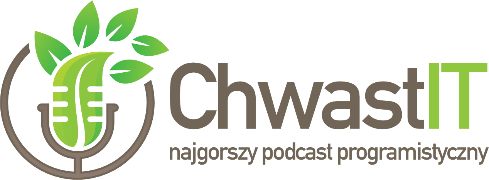

# This repo
We maintain the whole podcast in github, hence all the 
[**📅 scheduling**](../../issues), 
[**📄 notes**](../../issues), 
[**📦 episode files**](../../download) will land in here.  
Feel free to either [**✅ subscribe**](http://chwast.codearsonist.com/feed.xml) or clone the repo and sync it periodically.  
As you can see from the logo the podcast is PL-spoken/voiced-over, but feel free to drop as a line.

# Discussions/questions/suggestions
We are complete utter amateurs when it comes to podcasting. Feel free to join discussion in our per-episode github issues.

# Episode ideas
Feel free to dump us an issue with a quick idea what you'd like to hear and who we could chat to.
